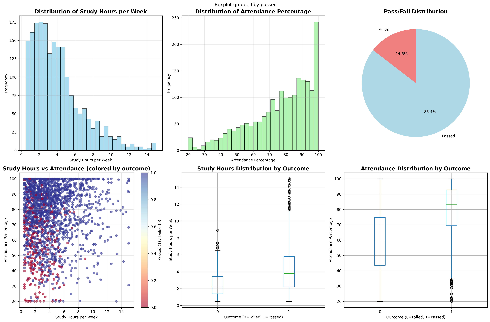
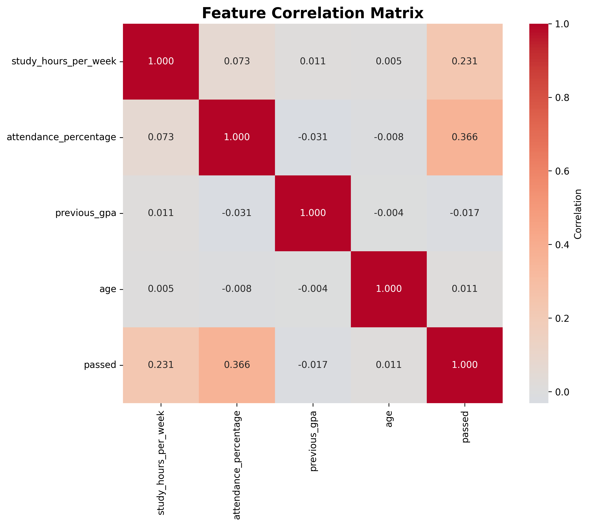
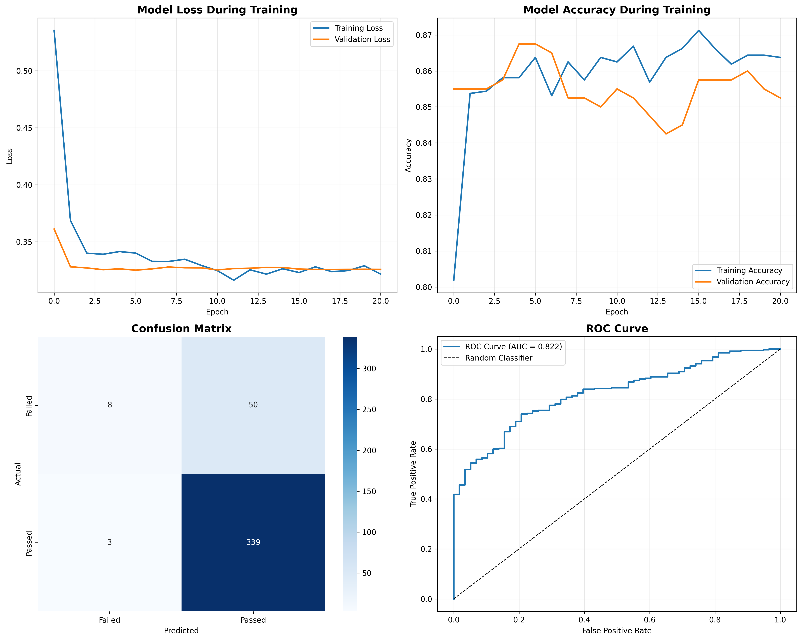
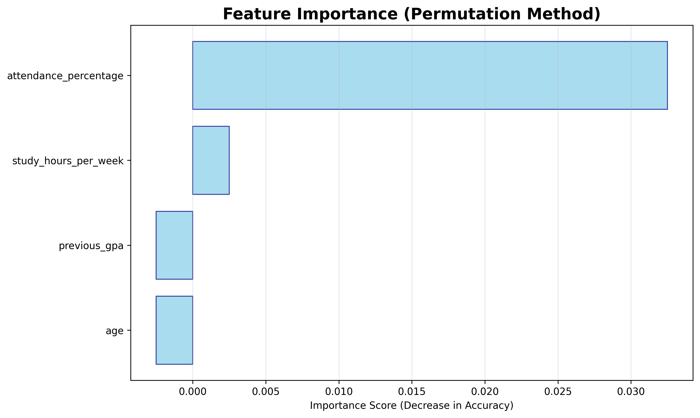

# Academic Performance Prediction Model

A comprehensive deep learning solution for predicting student academic performance using TensorFlow and neural networks. This project demonstrates end-to-end machine learning workflow from synthetic data generation to model deployment.

## Project Overview

This project builds a Deep Neural Network (DNN) to predict whether a student will pass or fail based on their study habits and academic history. The model achieves **86.7% accuracy** with an **AUC score of 0.822**, making it a reliable tool for educational institutions.

### Key Features

- **Synthetic Dataset Generation**: Creates realistic student performance data with correlated features
- **Deep Neural Network**: 5-layer fully connected network with dropout regularization
- **Comprehensive Analysis**: Feature importance, correlation analysis, and performance metrics
- **Model Checkpointing**: Automatically saves the best performing model
- **Rich Visualizations**: Professional charts and graphs for data insights
- **Production Ready**: Complete model deployment package with scaler and documentation

## Project Structure

```
academic-performance-prediction/
│
├── Data Files
│   └── student_performance_dataset.csv    # Generated synthetic dataset (2,000 students)
│
├── Model Files  
│   ├── student_performance_model.h5       # Final trained model
│   ├── best_model_checkpoint.h5          # Best model (highest validation accuracy)
│   └── scaler.pkl                        # Fitted StandardScaler for preprocessing
│
├── Visualizations
│   ├── data_distribution_plots.png       # 6-panel data analysis visualization
│   ├── correlation_matrix.png            # Feature correlation heatmap
│   ├── training_history_and_performance.png  # Training curves & performance metrics
│   └── feature_importance.png            # Feature importance analysis
│
├── Documentation
│   ├── model_summary.txt                 # Comprehensive model report
│   ├── README.md                         # This file
│   └── academic_performance_model.py     # Main Python script
│
└── Requirements
    └── requirements.txt                   # Python dependencies
```

## Dataset Features

The synthetic dataset includes **2,000 students** with the following features:

| Feature | Description | Range |
|---------|-------------|-------|
| **study_hours_per_week** | Weekly study hours | 0.5 - 15 hours |
| **attendance_percentage** | Class attendance rate | 20% - 100% |
| **previous_gpa** | Previous academic GPA | 0.0 - 4.0 |
| **age** | Student age | 18 - 25 years |
| **passed** | Target variable | 0 (Failed) / 1 (Passed) |

### Data Distribution



**Key Insights:**
- **Pass Rate**: 85.4% of students pass
- **Study Hours**: Most students study 2-4 hours per week (gamma distribution)
- **Attendance**: High attendance correlation with passing (mean: ~85%)
- **Clear Separation**: Passing students show distinct patterns in study habits

## Feature Correlations



**Correlation Analysis:**
- **Attendance ↔ Pass**: 0.366 (strongest predictor)
- **Study Hours ↔ Pass**: 0.231 (moderate correlation)
- **Previous GPA ↔ Pass**: -0.017 (surprisingly low)
- **Age ↔ Pass**: 0.011 (minimal impact)

## Model Architecture

### Neural Network Design
```
Input Layer (4 features)
    ↓
Dense Layer (128 neurons, ReLU) + Dropout (0.3)
    ↓
Dense Layer (64 neurons, ReLU) + Dropout (0.3)
    ↓
Dense Layer (32 neurons, ReLU) + Dropout (0.2)
    ↓
Dense Layer (16 neurons, ReLU)
    ↓
Output Layer (1 neuron, Sigmoid)
```

### Training Configuration
- **Optimizer**: Adam
- **Loss Function**: Binary Crossentropy
- **Batch Size**: 32
- **Max Epochs**: 100
- **Early Stopping**: Patience = 15 (monitoring validation loss)
- **Learning Rate Reduction**: Factor = 0.2, Patience = 5

## Model Performance



### Final Model Metrics
| Metric | Score |
|--------|-------|
| **Test Accuracy** | 86.7% |
| **Precision** | 87.1% |
| **Recall** | 97.6% |
| **AUC Score** | 0.822 |

### Best Checkpoint Model
The model checkpoint saved the best performing model based on validation accuracy:
- **Best Validation Accuracy**: 86.7%
- **Training completed in**: ~20 epochs (early stopping)

### Confusion Matrix Results
- **True Positives**: 339 (correctly predicted passes)
- **True Negatives**: 8 (correctly predicted failures)  
- **False Positives**: 50 (incorrectly predicted passes)
- **False Negatives**: 3 (incorrectly predicted failures)

## Feature Importance



**Ranking by Importance (Permutation Method):**
1. **Attendance Percentage** (0.032) - Most critical factor
2. **Study Hours per Week** (0.003) - Secondary importance
3. **Previous GPA** (0.002) - Minimal impact
4. **Age** (0.002) - Least important

## Quick Start

### Prerequisites
```bash
pip install tensorflow pandas numpy scikit-learn matplotlib seaborn joblib
```

### Running the Model
```python
# 1. Train the model
python academic_performance_model.py

# 2. Load trained model for predictions
import tensorflow as tf
import joblib
import numpy as np

# Load the best model and scaler
model = tf.keras.models.load_model('best_model_checkpoint.h5')
scaler = joblib.load('scaler.pkl')

# Make predictions for new students
new_student = np.array([[10.0, 90.0, 3.2, 20]])  # [study_hours, attendance, gpa, age]
new_student_scaled = scaler.transform(new_student)
prediction = model.predict(new_student_scaled)[0][0]

if prediction > 0.5:
    print(f"PASS (Probability: {prediction:.3f})")
else:
    print(f"FAIL (Probability: {prediction:.3f})")
```

### Example Predictions
```
Student 1: Study Hours: 12.0, Attendance: 95%, Previous GPA: 3.5, Age: 20
  Prediction: PASS (Probability: 0.974)

Student 2: Study Hours: 3.0, Attendance: 65%, Previous GPA: 2.0, Age: 19  
  Prediction: FAIL (Probability: 0.284)

Student 3: Study Hours: 8.0, Attendance: 85%, Previous GPA: 3.0, Age: 21
  Prediction: PASS (Probability: 0.789)
```

## Requirements

```txt
tensorflow>=2.13.0
pandas>=1.5.0
numpy>=1.24.0
scikit-learn>=1.3.0
matplotlib>=3.7.0
seaborn>=0.12.0
joblib>=1.3.0
```

## Model Deployment

### Loading the Model
```python
import tensorflow as tf
import joblib

# Load the best checkpoint model
model = tf.keras.models.load_model('best_model_checkpoint.h5')
scaler = joblib.load('scaler.pkl')
```

### Preprocessing New Data
```python
def preprocess_student_data(study_hours, attendance, gpa, age):
    """Preprocess student data for prediction"""
    student_data = np.array([[study_hours, attendance, gpa, age]])
    return scaler.transform(student_data)

def predict_performance(study_hours, attendance, gpa, age):
    """Predict student performance"""
    processed_data = preprocess_student_data(study_hours, attendance, gpa, age)
    probability = model.predict(processed_data)[0][0]
    prediction = "PASS" if probability > 0.5 else "FAIL"
    return prediction, probability
```

## Business Impact

### Use Cases
- **Early Warning System**: Identify at-risk students early in the semester
- **Resource Allocation**: Focus support on students with low predicted performance
- **Academic Planning**: Help students understand the importance of attendance and study habits
- **Institution Analytics**: Track trends in student performance predictors

### Key Insights
1. **Attendance is King**: 3x more important than study hours for predicting success
2. **Diminishing Returns**: Very high study hours (>12/week) show minimal additional benefit
3. **Age Independence**: Student age has virtually no impact on performance
4. **GPA Paradox**: Previous GPA shows surprisingly low correlation with current performance

## Future Enhancements

- [ ] **Real Dataset Integration**: Adapt model for actual student data
- [ ] **Additional Features**: Include assignment scores, participation, socioeconomic factors
- [ ] **Multi-class Classification**: Predict letter grades (A, B, C, D, F)
- [ ] **Ensemble Methods**: Combine multiple models for better accuracy
- [ ] **Real-time Dashboard**: Web interface for educators
- [ ] **Intervention Recommendations**: Suggest specific actions for at-risk students

## Contributing

1. Fork the repository
2. Create your feature branch (`git checkout -b feature/AmazingFeature`)
3. Commit your changes (`git commit -m 'Add some AmazingFeature'`)
4. Push to the branch (`git push origin feature/AmazingFeature`)
5. Open a Pull Request

## License

This project is licensed under the MIT License - see the [LICENSE](LICENSE) file for details.

## Author

**Academic Performance Prediction Model**
- LinkedIn: [Your LinkedIn Profile]
- Email: your.email@example.com
- GitHub: [Your GitHub Profile]

## Acknowledgments

- **TensorFlow Team** for the excellent deep learning framework
- **Scikit-learn** for comprehensive machine learning tools
- **Matplotlib & Seaborn** for beautiful data visualizations
- **Educational Research Community** for insights on student performance factors

---

**Star this repository if you found it helpful!**

**Built with passion for education and machine learning**